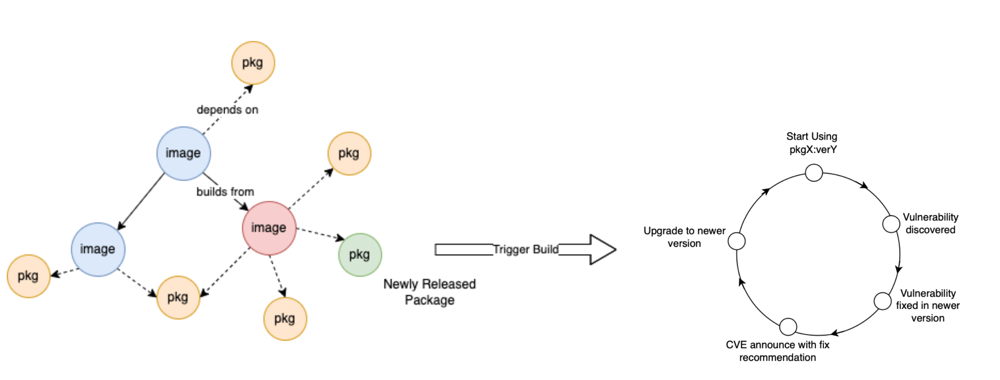

# Smart & Distributed Vulnerability Remediation
** **

## 1. Vision and Goals Of The Project:

Container build patterns are increasingly becoming layered and for different layers of applications, in retrospect, supply chains used to be evident and explicit, which means that respective software vendors were liable to ensure and maintain security of their own software. In such a pattern, we are obviously even its maintainers and supply chain and we are likely to do vulnerability remediations like “fix where discovered”, which is not inefficient.

In this project, we will design a new distributed system that would allow us to bind build workflows across all our dependencies through a common eventing framework, on which we can orchestrate smart, optimal remediation workflows.

## 2. Users/Personas Of The Project:

As for the users of the project, we have SBOM and Build operators, maintainers and coordinators of different dependency repos/pipelines.

SBOM operators will help to provide complete, accurate and auditable record of every dependency, Build operators will build the images based on its dependencies and a dependency graph is generated during this process and stored in the graph database for the remediation. And for the coordinator and maintainer of pipelines, When vulnerability happens, they will know where to fix based on dependency graph and also when there’s new update of  the exact information of the new update for a image of dependency,

** **

## 3.   Scope and Features Of The Project:

#### Software Bill-of-Material is in-scope

We propose replacing existing imperative build patterns with declarative patterns, wherein, instead of defining a recipe, developer can just define a desired build state for their applications. Multiple build operators then can then be implemented to achieve and maintain the desired state in a control loop. The operators should also functionally support observability and integrity.

#### Gauge is in-scope

For a given open-source package, guage measures risk from every commit that went into the new release, developers that contributed those changes, code review practices observed, and types of changes (performance improvement, security fix, feature additions, etc.) that went into the release

#### Declarative build

In the wake of recent mission to attain higher cybersecurity standard, in the project, we are motivated to re-think our build framework from scratch that can bring these operational features along with re-producibility and compliance together as design principles.

The idea here is not to reinvent the wheel, but to design a pluggable interface through which existing tools can be easily intergrated into the framework

####Remediation Strategy  
According to the graph of depandency, we will build an analyzer to give some strategy of dependency. 

<!--- The Scope places a boundary around the solution by detailing the range of features and functions of the project. This section helps to clarify the solution scope and can explicitly state what will not be delivered as well.

It should be specific enough that you can determine that e.g. feature A is in-scope, while feature B is out-of-scope.-->

** **

## 4. Solution Concept

#### Global Architectural Structure Of the Project:

<!--Diagram-->

#### Design Implications and Discussion:

As shown in the diagram, in this project, we are going to build:

- Dependency map: Dependencies need to be explicitly captured at different granularity  in order to find the source of vulnerabilities.
- Optimal solution: Find the optimal way to solve the vulnerabilities found. 

## 5. Acceptance criteria

By the end of the project, the following functions should be implemented:
- Vulnerability detection at the provenance
- Output optimal way to solve vulnerability

## 6.  Release Planning:

In progress.
<!--Release planning section describes how the project will deliver incremental sets of features and functions in a series of releases to completion. Identification of user stories associated with iterations that will ease/guide sprint planning sessions is encouraged. Higher level details for the first iteration is expected.-->

** **
## Related Documents
- poster: https://docs.google.com/presentation/d/1_N0urFKCJ-23BZFcvQR3AcJwWoLoiiNFEqtA_bDCen4/edit?skip_itp2_check=true&pli=1#slide=id.p
- final pre slides: https://docs.google.com/presentation/d/145sacAcYkqsmekxDTuJ9pQDzaL_8qK6cIZFVKxI3ryc/edit#slide=id.g1b2351fde6f_0_55
- sprint demo:
  https://docs.google.com/presentation/d/1n6usCncJd_V_afQFMQHXu33kbbwhpFoQpcyjVOqavO0/edit#slide=id.p  
  https://docs.google.com/presentation/d/1LO_O5CiFCa5McuDa9-SRG5doFD3QSszVJftY-I8A1Uw/edit#slide=id.p  
  https://docs.google.com/presentation/d/1q9DMqCMvDOiM0_hYWWez8LTY05n5uYkXdZQdVnnTRc0/edit#slide=id.g185513f3292_0_55
  https://docs.google.com/presentation/d/18_dD2pfs6HdU550fdgGbVIS72dKMRpFigeEXKGW5oVU/edit#slide=id.g185513f3292_0_55
  https://docs.google.com/presentation/d/1siBshVbfkEC6DI9eYTD_9VWEpWWRnl9MfsrunrRvh7o/edit#slide=id.g1ac05358e85_0_55
** **

## Further Discussion:

In progress.

